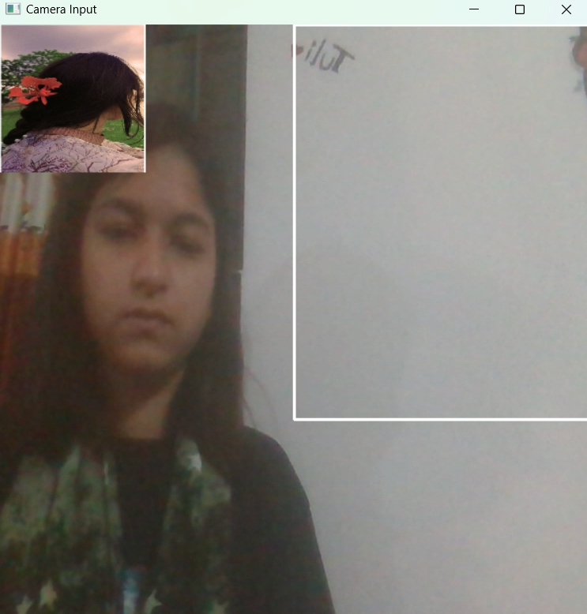

# Virtual-Zoom-In-and-Zoom-out-and-Rotation_Image_Project_CSE4128
# Dynamic Image Gestures: Zoom in and out and Rotate

##Introduction

This project focuses on leveraging computer vision techniques to recognize hand gestures and manipulate an image accordingly. The system is designed to detect hand gestures using a webcam, segment the hand region,and apply the corresponding image transformation (zoom or rotate) based on the detected gestures.

##Features
The project utilizes OpenCV, a powerful library for computer vision, to process video frames 
captured by a webcam. The key steps involved in the project include:
1. Capturing video input from the webcam.
2. Defining a region of interest (ROI) for hand gesture detection.
3. Calibrating the background for accurate hand segmentation.
4. Detecting and segmenting the hand region.
5. Identifying hand gestures to determine the type of image manipulation (zoom or rotate).
6. Applying the corresponding transformation to the image.

##Programming Environment
1. Visual Studio Code or
2. Spider
   
##Programming Language
1. Python 3.11.3

###Project Screensorts
#Initial Frame

   

   
   

