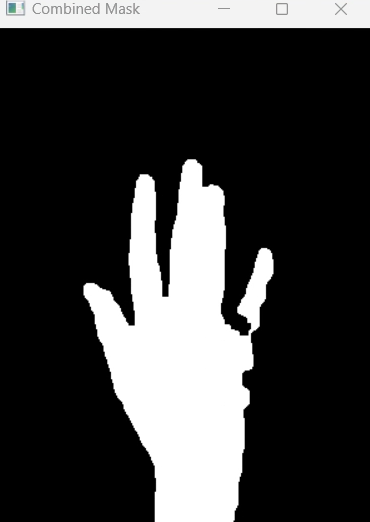
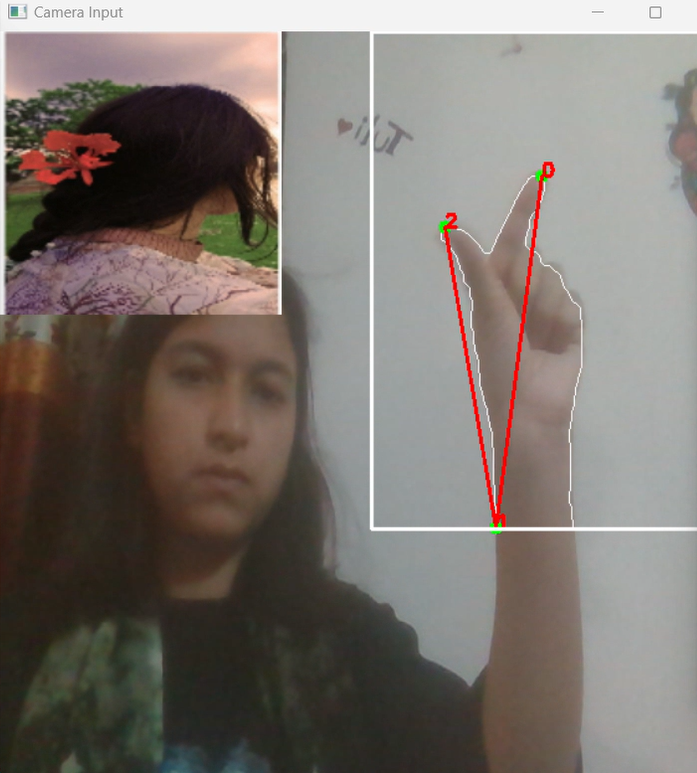

# Virtual-Zoom-In-and-Zoom-out-and-Rotation_Image_Project_CSE4128
# Dynamic Image Gestures: Zoom in and out and Rotate

##Introduction

This project focuses on leveraging computer vision techniques to recognize hand gestures and manipulate an image accordingly. The system is designed to detect hand gestures using a webcam, segment the hand region,and apply the corresponding image transformation (zoom or rotate) based on the detected gestures.

##Features

The project utilizes OpenCV, a powerful library for computer vision, to process video frames 
captured by a webcam. The key steps involved in the project include:
1. Capturing video input from the webcam.
2. Defining a region of interest (ROI) for hand gesture detection.
3. Calibrating the background for accurate hand segmentation.
4. Detecting and segmenting the hand region.
5. Identifying hand gestures to determine the type of image manipulation (zoom or rotate).
6. Applying the corresponding transformation to the image.

##Programming Environment
1. Visual Studio Code or
2. Spider
   
##Programming Language
1. Python 3.11.3

###Project Screensorts

#Initial Frame

This is the initial frame where in top left corner test image is shown.
#Region Of Interest

In this region, I will put my hand after calibration time to detect the hand.

#Skin Detection

YCrCb and HSV color spaces are used to create binary masks to detect hand only.

#Combining Masks

Combined mask is created to isolate the hand more accurately.

#Contour Detection

Contours are found by using cv2.findContours() which are ideal for detecting the outline of the hand.

#Convex Hull Calculation and Find Tips

I calculated convex hull to find the finger tips. After Calculating covex hull I took only top tip points.

#Distance Calculation

I calculated the euclidean distance between thumb finger's tip point and index finger's tip point. When the distance is decreased image size is decreased and when the distance is increased image size is increased.

#Rotation Mode

The change in angle between the thumb and index finger is used to determine the rotation of the image. The difference between the current angle and the initial angle (startAngle) indicates the degree of rotation.

#Final Results

   
   

